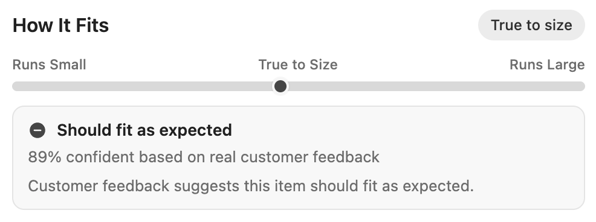
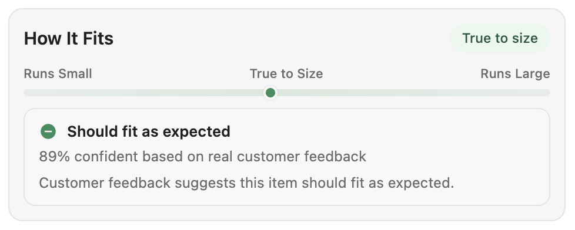
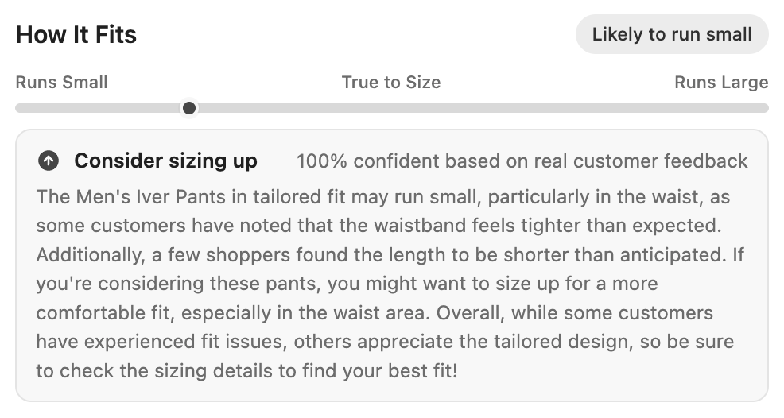
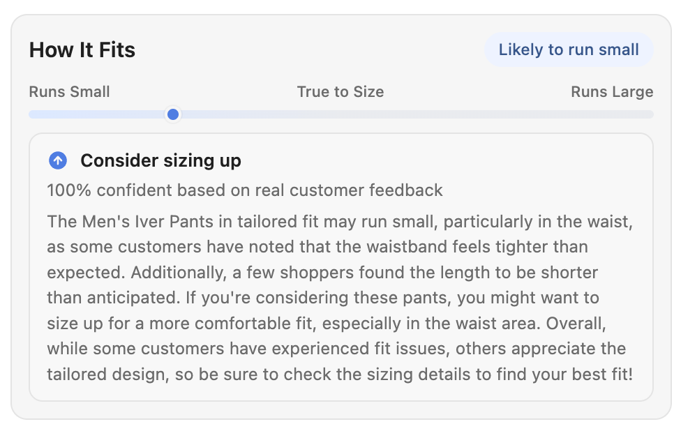
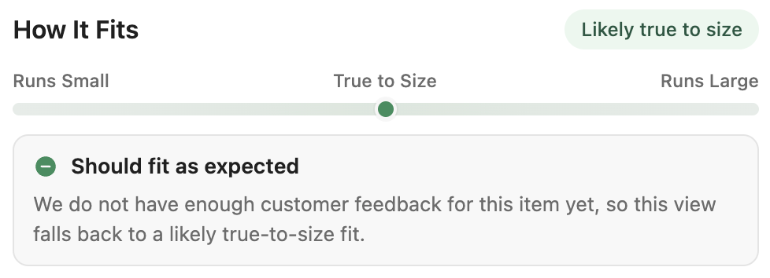
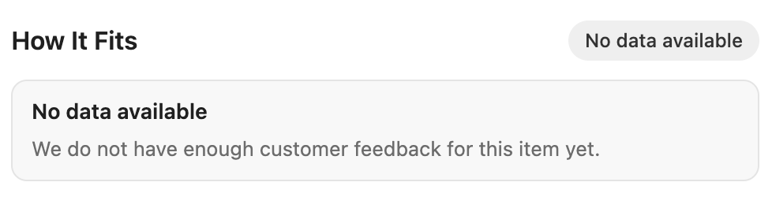

# Selection Guide UI

Open-source reference implementation of an embeddable size recommendation widget for retailer product detail pages (PDPs). Renders fit guidance — category, bar position, confidence score, and an AI-generated customer feedback summary — powered by the [parcelLab Size Recommender API](https://product-api.parcellab.com/v4/docs/#tag/Size-Recommender).

Use this widget as-is, or as a starting point for building your own custom integration against the API.

**[Live demo](https://cdn.parcellab.com/playground/selection-guide-ui/)**

**Sample with short info text**

| | |
| :---: | :---: |
|  |  |
| neutral color, comfortable spacing, inline display | colored, compact spacing, card display |

**Sample with longer info text**

| | |
| :---: | :---: |
|  |  |
| neutral color, compact spacing, inline display | colored, compact spacing, card display |

**Missing data**

| | |
| :---: | :---: |
|  |  |
| `notFoundMode: 'true-to-size'` — shows default fit info | `notFoundMode: 'empty'` — shows missing data notice |

## Overview

The widget fetches a size recommendation for a given product and account, then renders a compact, customizable UI that shows:

- **Fit category** — whether the item runs small, true to size, or large
- **Fit position bar** — a visual scale from "Runs small" to "Runs large" with a marker
- **Confidence score** — how confident the recommendation is (e.g., "Based on 85% of reviews")
- **Customer feedback summary** — an LLM-generated summary of customer sizing feedback

It ships as a zero-dependency bundle in two formats:

| Format | File | Use case |
| --- | --- | --- |
| IIFE | `dist/size-recommender.iife.js` | `<script>` tag embeds — auto-initializes from `data-*` attributes |
| ESM | `dist/size-recommender.esm.js` | Module bundlers and `import` consumers |

## Quick Start

### HTML Embed (simplest)

```html
<div
  data-size-recommender
  data-account-id="YOUR_ACCOUNT_ID"
  data-product-id="YOUR_PRODUCT_ID"
  data-not-found-mode="true-to-size"
></div>

<script src="https://cdn.parcellab.com/js/selection-guide-ui/v1/size-recommender.iife.js" defer></script>
```

The IIFE build auto-initializes every `[data-size-recommender]` element on the page.

### JavaScript API

```js
const widget = window.SizeRecommender.init({
  target: '#size-recommender',
  accountId: 1617954,
  productId: "Men's Iver Pants (tailored fit)",
  locale: 'de',
  appearance: 'neutral',
  density: 'compact',
  surface: 'subtle',
  notFoundMode: 'true-to-size',
  showPill: true,
  showScale: true,
  showRecommendation: true,
  showSummary: true,
  className: 'merchant-fit-widget',
  theme: {
    backgroundColor: '#f6f6f6',
    textColor: '#222222',
    mutedTextColor: '#666666',
    borderColor: '#e4e4e4',
    radius: '12px'
  },
  messages: {
    title: 'How It Fits',
    recommendationHeadingSmall: 'Consider sizing up'
  }
});

// Update for a different product without re-mounting
widget.update({ productId: "Women's New Product" });

// Tear down the widget
widget.destroy();
```

## API

The widget calls the parcelLab Size Recommender API:

```
GET {apiBaseUrl}/v4/size-recommender/recommendation/{productId}/?account_id={accountId}
```

Default base URL: `https://product-api.parcellab.com`

Full API documentation: [Size Recommender API Reference](https://product-api.parcellab.com/v4/docs/#tag/Size-Recommender)

### Response Fields Used

| Field | Description |
| --- | --- |
| `size_fit_category` | Fit label (e.g., "Likely to run small") |
| `smoothed_fit_position` | Position on the fit scale (-1 to 1) |
| `confidence_smetabase_core` | Confidence percentage |
| `llm_summary` | AI-generated customer feedback summary |

## Configuration

| Option | Type | Default | Description |
| --- | --- | --- | --- |
| `target` | `string \| HTMLElement` | — | **Required** for JS init. CSS selector or DOM element. |
| `accountId` | `number \| string` | — | **Required**. parcelLab account identifier. |
| `productId` | `string` | — | **Required**. Product identifier passed to the API. |
| `articleName` | `string` | — | Legacy alias for `productId`. Still accepted for backwards compatibility. |
| `locale` | `string` | `'en'` | Language for default messages. Supported: `en`, `de`, `fr`, `it`, `es`. |
| `messages` | `Partial<WidgetMessages>` | — | Override any default message string. |
| `notFoundMode` | `'empty' \| 'true-to-size' \| 'hidden'` | `'empty'` | Behavior when the API returns 404. `hidden` hides the widget entirely. |
| `apiBaseUrl` | `string` | `'https://product-api.parcellab.com'` | Override the API base URL. |
| `appearance` | `'neutral' \| 'colored'` | `'neutral'` | `neutral` is grayscale; `colored` uses gradient track. |
| `density` | `'compact' \| 'comfortable'` | `'compact'` | `compact` suits PDP sidebars; `comfortable` adds more spacing. |
| `surface` | `'subtle' \| 'plain'` | `'subtle'` | `subtle` renders a light card; `plain` renders inline. |
| `showPill` | `boolean` | `true` | Show or hide the fit category pill badge. |
| `showScale` | `boolean` | `true` | Show or hide the fit position scale bar. |
| `showRecommendation` | `boolean` | `true` | Show or hide the entire recommendation box. |
| `showSummary` | `boolean` | `true` | Show or hide the LLM summary within the recommendation. |
| `className` | `string` | — | Extra CSS classes added to the root element. |
| `theme` | `Partial<WidgetTheme>` | — | CSS token overrides (colors, radius, etc.). |

### HTML Data Attributes

When using the IIFE auto-init, configure via `data-*` attributes:

```html
<div
  data-size-recommender
  data-account-id="1617954"
  data-product-id="Men's Iver Pants (tailored fit)"
  data-not-found-mode="true-to-size"
  data-appearance="colored"
  data-density="comfortable"
  data-surface="plain"
  data-locale="de"
  data-show-pill="true"
  data-show-scale="true"
  data-show-recommendation="true"
  data-show-summary="false"
  data-messages='{"title":"How It Fits"}'
  data-theme='{"backgroundColor":"#f6f6f6","radius":"12px"}'
  data-class-name="my-custom-class"
></div>
```

## 404 Handling

When a product has no recommendation data, the widget supports three modes:

- **`empty`** (default) — shows a "no data available" message
- **`true-to-size`** — renders a "likely true to size" fallback without confidence or summary
- **`hidden`** — hides the widget entirely (`display: none`); the widget reappears when valid data is provided via `update()` or `refresh()`

## Styling

The widget renders in **light DOM** (not Shadow DOM), so host-page typography inherits naturally and you can target the markup directly with CSS.

### Root Classes

```
.pl-size-recommender
.pl-size-recommender--{neutral|colored}
.pl-size-recommender--density-{compact|comfortable}
.pl-size-recommender--surface-{subtle|plain}
.pl-size-recommender--state-{loading|ready|fallback-true|empty|error|hidden}
.pl-size-recommender--fit-{small|true|large|unknown}
```

### Element Classes

```
.pl-size-recommender__header                  — header row (title + pill)
.pl-size-recommender__title                   — "How It Fits" heading
.pl-size-recommender__pill                    — fit category badge
.pl-size-recommender__scale                   — scale container (labels + track)
.pl-size-recommender__scale-labels            — "Runs Small / True to Size / Runs Large"
.pl-size-recommender__track                   — the horizontal fit bar
.pl-size-recommender__marker                  — position dot on the track
.pl-size-recommender__recommendation          — recommendation callout card
.pl-size-recommender__recommendation-header   — header row inside recommendation
.pl-size-recommender__recommendation-icon     — fit direction icon (↑/↓/−)
.pl-size-recommender__recommendation-title    — e.g., "Consider sizing up"
.pl-size-recommender__recommendation-meta     — confidence text
.pl-size-recommender__recommendation-summary  — AI-generated feedback summary
```

### Hiding Elements

Use `display: none` on any element class to hide specific parts:

```css
/* Hide the confidence score */
.pl-size-recommender__recommendation-meta { display: none; }

/* Hide the AI summary text */
.pl-size-recommender__recommendation-summary { display: none; }

/* Hide the fit category pill badge */
.pl-size-recommender__pill { display: none; }

/* Hide the entire scale bar */
.pl-size-recommender__scale { display: none; }

/* Hide the widget entirely when in empty/no-data state */
.pl-size-recommender--state-empty { display: none; }
```

### CSS Variables

Override these on `.pl-size-recommender` or any ancestor:

| Variable | Description |
| --- | --- |
| `--plsr-background` | Widget background color |
| `--plsr-recommendation-background` | Recommendation callout background |
| `--plsr-border` | Border color |
| `--plsr-text` | Primary text color |
| `--plsr-muted-text` | Secondary/muted text color |
| `--plsr-accent` | Accent color for highlights |
| `--plsr-badge-background` | Fit category badge background |
| `--plsr-badge-text` | Fit category badge text color |
| `--plsr-track` | Scale track color (neutral mode) |
| `--plsr-track-start` | Track gradient start (colored mode) |
| `--plsr-track-end` | Track gradient end (colored mode) |
| `--plsr-radius` | Border radius |

## Widget Instance API

The `init()` call returns a `WidgetInstance` with these methods:

| Method | Description |
| --- | --- |
| `update(config)` | Update configuration and re-fetch. Cancels any in-flight request. |
| `refresh()` | Re-fetch with current configuration. |
| `destroy()` | Remove the widget from the DOM and clean up. |

## Development

```sh
npm install
npm run dev
```

Opens a demo page at [http://localhost:4173](http://localhost:4173) with interactive controls for product ID, account ID, appearance, density, surface, and 404 mode. The demo generates copyable embed snippets for both HTML and JS integration styles.

### Build

```sh
npm run build
```

Produces `dist/size-recommender.iife.js` and `dist/size-recommender.esm.js` with TypeScript type definitions.

### Test

```sh
npm test
```

Runs the Vitest test suite with jsdom.

### Deployment

The project deploys to S3/CloudFront via GitHub Actions:

- **Staging:** automatically deployed on push to `main` to `s3://parcellab-cdn/playground/selection-guide-ui/`
- **Production:** deployed on GitHub release to `s3://parcellab-cdn/js/selection-guide-ui/v1/` (latest) and `s3://parcellab-cdn/apps/selection-guide-ui/v1/{tag}/` (versioned)

Build the demo site locally:

```sh
npm run build
npm run build:site
```

## Building Your Own

This widget is an open-source reference implementation. If you need a custom integration, you can:

1. **Use the API directly** — call the [Size Recommender API](https://product-api.parcellab.com/v4/docs/#tag/Size-Recommender) from your own frontend code and render the response however you like.
2. **Fork this repo** — start from this codebase and customize the rendering, styling, and behavior to match your exact requirements.
3. **Use as a library** — import the ESM build and override messages, theme, and CSS to fit your design system.

The source code in `src/` is organized into clear modules (API client, config resolution, model transformation, rendering) that you can reference or reuse.

## Related

- [Size Recommender API Reference](https://product-api.parcellab.com/v4/docs/#tag/Size-Recommender) — full API documentation
- [selection-guide](https://github.com/parcelLab/selection-guide) — backend service powering the size recommendations (parcelLab internal)

## License

[MIT](LICENSE) — Copyright (c) 2026 Julian Krenge
